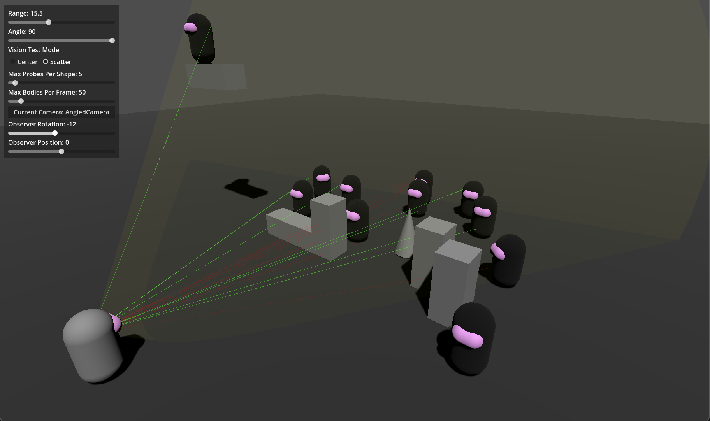
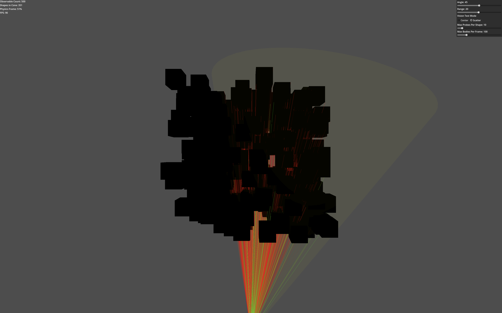

<div style="text-align:center;">
	<br/>
	<br/>
	
	<br/>
	<div style="font-size: 80px;">VisionCone3D</div>
	Simple but configurable 3D vision cone node for <a href="https://godotengine.org/">Godot</a>
	<br/>
	<br/>
	<br/>
	
	
	
	<br/>
	<br/>
	<br/>
</div>


## Features

### Basic Features

* VisionCone3D - a node which tracks whether or not objects within its cone shape can be "seen"
* Edit range/angle of cone via 3D viewport editor gizmo
* Debug visualization to easily diagnose any issues

### Advanced Performance-Tuning Features

* Configurable vision probe settings
* Ignore some physics bodies (eg the parent body)
* Separate masks for bodies that can be seen and bodies that can only occlude

<div style="text-align:center;">
</div>

## Installation

Options:

* Install via the AssetLib tab in Godot by searching for VisionCone3D
* Use [gd-plug](https://github.com/imjp94/gd-plug)
* Download zip archive or clone from GitHub, open `addons/`, copy `tattomoosa.vision_cone_3d/` into your project's `addons` folder

## Usage

Add the VisionCone3D node to your scene. Turn on debug draw

### Connect to the body visible signals

These signals fire when a body is newly visible or newly hidden.

```gdscript
extends Node3D

@export var vision_cone : VisionCone3D

func _ready():
	vision_cone.body_sighted.connect(_on_body_sighted)
	vision_cone.body_hidden.connect(_on_body_hidden)

func _on_body_sighted(body: Node3D):
	print("body sighted: ", body.name)

func _on_body_hidden(body: Node3D):
	print("body hidden: ", body.name)
```

### Poll the currently visible bodies

Get a list of the bodies which are currently visible

```
extends Node3D
@export var vision_cone : VisionCone3D

func _physics_process():
	print("bodies visible: ", vision_cone.get_visible_bodies())
```

### Vision Test Modes

#### Center

Samples only the center point (position) of the CollisionShape. Most efficient.

#### Sample Random Vertices

Uses CollisionShape's `get_debug_mesh` to get a mesh representation of the CollisionShape,
then samples random vertex points from that mesh.

Configuration:
* Maximum probes used per body per frame: `vision_test_shape_max_probe_count`

### Collision Masks

VisionCone3D has 2 collision masks, one used for bodies that can be seen by the cone and one for an environment,
which can occlude seen bodies but is not itself probed for visibility.

For example, add the level collision layer to `collision_environment_mask` and the player/enemy/object collision layer to the `collision_mask`.
The player/enemy/object can then hide behind the level, but no processing/probing will occur on the level collision geometry itself.

## The Future

### Performance


### 2D Support?

I am open to adding a 2D version of this addon if there is sufficient interest.

See if [VisionCone2D](https://github.com/d-bucur/godot-vision-cone) meets your needs. No relation.
